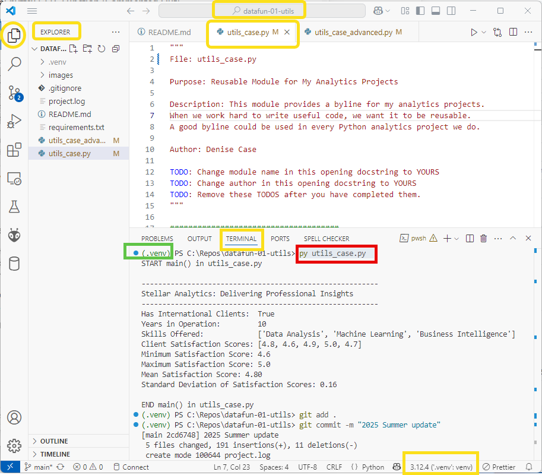

# datafun-01-utils

Reusable module for my Data Analytics Python projects

## Project Requirements

- VS Code
- Git
- Python 

## Workflow

See [pro-analytics-01](https://github.com/denisecase/pro-analytics-01/)

## Commands to Manage Virtual Environment

For Windows PowerShell (change if using Mac/Linux)

```powershell
py -m venv .venv
.\.venv\Scripts\activate
py -m pip install --upgrade pip setuptools wheel
py -m pip install --upgrade -r requirements.txt
```

## Commands to Run Python Script

```shell
py utils_case.py
py utils_case_advanced.py
```

## Commands to Git add-commit-push

```shell
git add .
git commit -m "custom message"
git push -u origin main
```

## Reference Project

Custom implementation of the example reusable project at 
[datafun-01-util](https://github.com/denisecase/datafun-01-utils)

## Markdown Notes

- A Markdown title starts with: hash space
- A Markdown second-level heading starts with: hash hash space
- A Markdown un-ordered list starts with: dash space
- A Markdown ordered list start with: 1. space
- Markdown code fencing uses three **back tics** on their own line to display code and commands.
- Markdown **bold text** is surrounded by: two asterisks
- Markdown *underline text* is surrounded by: one asterisk
- Markdown is critical for project README files, Jupyter Notebooks, and writing technical papers with Sphinx

## Example Screenshots


